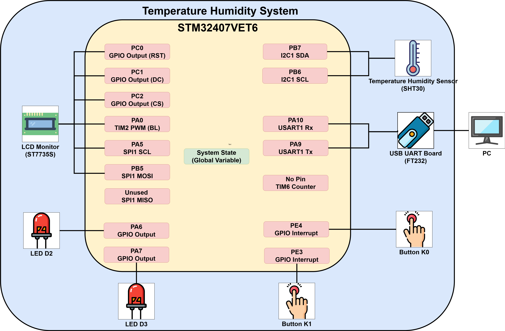

# STM32 溫濕度計
## [DEMO 影片](https://www.youtube.com/shorts/4FXxjA_4-fE)

## 硬體架構圖


## 系統流程圖
<!-- 


 -->


## 一、專案目標

本專案是一個基於 STM32F407VET6 微控制器的嵌入式系統實作，整合了 FreeRTOS 即時作業系統。系統能夠**透過 I2C 讀取 SHT30 溫溼度數據**，利用**SPI 驅動 ST7735 彩色螢幕進行即時顯示**，並支援透過 **UART 與電腦進行雙向通訊與控制**。

本專案旨在練習嵌入式韌體工程的核心能力，包含 **驅動開發、RTOS 多工管理 (Task/Task Notify/Stream Buffer/Semaphore/Mutex)** 以及軟硬體整合設計。

## 二、硬體與開發工具清單

### 1. 硬體元件

| 品項名稱 | 類型 | 數量 | 功能說明 |
| --- | --- | --- | --- |
| STM32F407VET6 開發板 | MCU  | 1 | 主板 |
| SHT30 模組 | 輸入裝置 | 1 | I2C 溫濕度感測器 |
| ST7735 模組 | 輸出裝置 | 1 | SPI 顯示模組，顯示溫濕度與 ADC 數值 |
| FT232 USB to UART 模組 | 通訊模組 | 1    | 與電腦進行 UART 通訊 |
| 杜邦線(母母)| 線材 | 約 20 | 模組與開發板之間連接用  |
| ST-Link V2 燒錄器 | 開發工具 | 1 | 燒錄、Debug、供電 |

### 2. 軟體工具

| 類別 | 工具名稱 |
| ---- | --- |
| IDE  | VSCode |
| VSCode 擴充套件 | C/C++、CMake Tools、Cortex-Debug、 STM32CubeIDE for Visual Studio Code、clangd |
| 專案生成 | STM32CubeMX 6.14.1 |
| 編譯工具 | GCC (arm-none-eabi-gcc) |
| 建構工具 | CMake |
| 燒錄   | ST-Link |
| 除錯   | VSCode Debug Tool |
|嵌入式作業系統| FreeRTOS |
| 程式碼開發作業系統   | Windows 11 |

---

## 三、專案庫架構

本專案採用「程式源碼」與「開發文件」分離的雙目錄結構，確保開發環境單純，並將建置過程文件化以利維護。

### 1. 根目錄結構

```text
Project_Root/
├── code/   # 韌體專案本體 (Firmware Source)
└── notes/  # 專案文件與筆記 (Documentation)

```

### 2. 目錄內容說明

#### **Code (`/code`)**

* **定位**：實際執行的 STM32 韌體專案。所有的編譯 (Build)、燒錄 (Flash)、除錯 (Debug) 皆在此目錄下進行。
* [點此查看專案軟體架構與 RTOS 設計說明](./code/README.md)

#### **Notes (`/notes`)**

* **定位**：開發過程的知識庫，紀錄環境建置、硬體參數與外部參考資料。
* [點此查看開發筆記與環境建置指南](./notes/README.md)

---
## 四、快速上手 (User Manual)

### 4.1 環境設置

1. **硬體連接**：請參考 [硬體接線表](./notes/1_hardware_connection.md) 完成模組連線。
2. **軟體安裝**：請參考 [開發環境建置指南](./notes/1_development_enviroment_setting.md) 安裝 VSCode 與 Toolchain。
3. **編譯專案**：將 VSCode 工作目錄切換到 `./code`，在左側檔案列表對 `CMakeLists.txt` 按下右鍵，選擇 `Build All Projects`。
4. **燒錄執行**：連接 ST-Link，在 VSCode 中點擊 `Run and Debug` (或按 F5) 執行燒錄與除錯。

### 4.2 按鈕與 LED 操作說明

* **按鈕 K0 (PE4)**：
    * 功能：切換顯示模式。
    * 行為：按下後螢幕將在「溫度顯示」與「濕度顯示」之間切換。


* **按鈕 K1 (PE3)**：
    * 功能：調整螢幕亮度。
    * 行為：每次按下亮度增加 10%，循環調整 (0% -> 100% -> 0%)。


* **LED D2 (PA6)**：
    * 功能：溫度警示。
    * 行為：當目前溫度 **高於上限** 或 **低於下限** 時亮起。


* **LED D3 (PA7)**：
    * 功能：濕度警示。
    * 行為：當目前濕度 **高於上限** 或 **低於下限** 時亮起。


### 4.3 UART 雙向通訊

#### 4.3.1 指令控制
請將 USB 轉 TTL 模組連接至電腦，並開啟序列埠監控軟體(如 TeraTerm)

* **通訊參數**：
    * Baud Rate: 115200
    * Data bits: 8
    * Stop bits: 1
    * Parity: None
* **指令格式**：固定 3 Bytes HEX (十六進位)
    * Byte 0: Item (項目)
    * Byte 1: Sub-Item (子項目)
    * Byte 2: Value (數值)
#### 指令列表
| 功能 | Byte 0 | Byte 1 | Byte 2 (Value) | 範例 (HEX) | 說明 |
| --- | --- | --- | --- | --- | --- |
| **設定溫度上限** | 00 | 00 | 0~99 (°C) | `00 00 1E` | 設定溫度上限 30°C |
| **設定溫度下限** | 00 | 01 | 0~99 (°C) | `00 01 0A` | 設定溫度下限 10°C |
| **設定濕度上限** | 01 | 00 | 0~99 (%) | `01 00 3C` | 設定濕度上限 60% |
| **設定濕度下限** | 01 | 01 | 0~99 (%) | `01 01 14` | 設定濕度下限 20% |
| **設定螢幕亮度** | 02 | 00 | 0~100 (%) | `02 00 64` | 設定亮度 100% |
| **切換顯示模式** | 02 | 01 | 0 或 1 | `02 01 01` | 0: 溫度, 1: 濕度 |

> **注意**：目前設定一次最多接收5組指令

#### 4.3.2 Log 輸出

**Log 範例：**

```text
[timestamp] 1234 
[error] sht30: 0 , pc_link: 0, lcd_monitor: 0
[temperature] 26, threshold: 22 , 27
[humidity] 55 , threshold: 40 , 60 
[lcd] brightness: 100 , mode: 0
[period] sht30 measure: 100 , log report: 1000 , lcd refresh: 100

```

**欄位說明：**

1. **timestamp**: 系統啟動後的計數器數值。
2. **error**: 各任務的超時錯誤計數 (0 代表正常)。
3. **temperature**: 當前溫度值，後方為下限與上限閾值。
4. **humidity**: 當前濕度值，後方為下限與上限閾值。
5. **lcd**: 當前亮度 (0-100) 與顯示模式 (0: Temp, 1: Hum)。
6. **period**: 當前各任務的執行週期設定 (ms)。