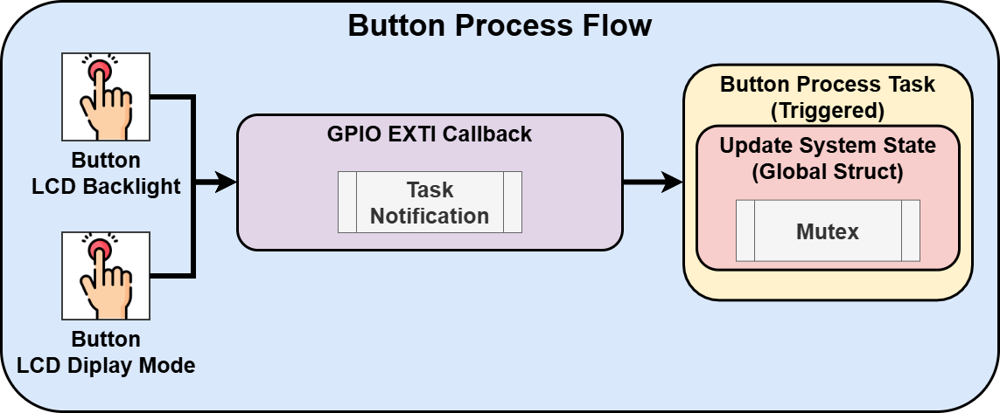
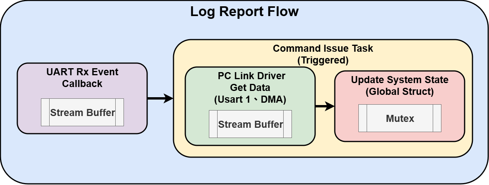
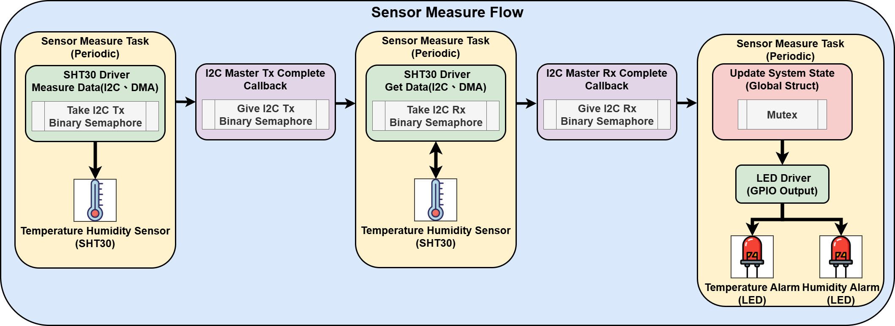
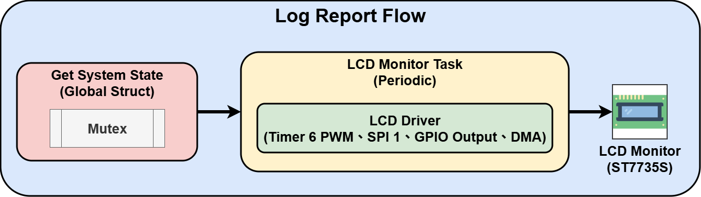
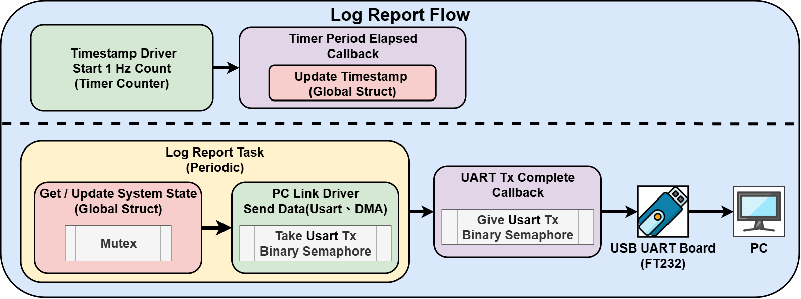

# STM32 韌體架構與 RTOS 設計文件

## 1. 軟體分層架構 (Software Architecture)

本專案採用 **分層式架構 (Layered Architecture)**，由下而上分為三層，確保硬體驅動與應用邏輯解耦。

| 層級 | 資料夾 | 職責說明 | 相依性 |
| --- | --- | --- | --- |
| **Application** | `Task/` | **應用邏輯層**。負責 FreeRTOS 任務的流程控制、狀態機與資源調度。 | 依賴 System, Module |
| **System** | `System/` | **系統配置層**。負責全域資料狀態 (`system_state`)、板級定義 (`board_config`) 、中斷路由 (`interrupt_callback`)、任務定義(`task_config`) | 依賴 Module |
| **Driver** | `Module/` | **硬體驅動層**。封裝 STM32 HAL 庫，提供硬體抽象 API (如 `lcd_init`, `sht30_read`)。 | 無 |
| **BSP/HAL** | `Core/` | **底層生成碼**。由 STM32CubeMX 生成的初始化代碼。 | - |

---

## 2. 專案目錄結構

```text
code/
├── Core/                     # STM32CubeMX 生成之底層代碼 (Main, IT, HAL Config)
├── Task/                     # FreeRTOS 應用任務
│   ├── sensor_measure_task   # 溫濕度量測與 LED 警示判斷
│   ├── lcd_monitor_task      # 螢幕畫面刷新與顯示邏輯
│   ├── log_report_task       # 系統狀態 Log 回報
│   ├── command_issue_task    # UART 指令接收與解析
│   └── button_process_task   # 按鈕事件處理
├── System/                   # 系統級配置
│   ├── board_config          # 板級模組 Handle 定義 (SHT30, LCD, UART...)
│   ├── system_state          # 全域系統狀態結構與 Mutex 保護機制
│   ├── interrupt_callback    # ISR 中斷路由 (將硬體中斷轉發給 RTOS Task)
│   └── task_config           # FreeRTOS 任務的建立與優先級設定
└── Module/                   # 硬體驅動模組
    ├── sht30                 # I2C 溫濕度感測器驅動
    ├── lcd                   # SPI ST7735 螢幕驅動 (含 DMA)
    ├── pc_link               # UART DMA 通訊驅動 (含 DMA)
    ├── button                # GPIO 按鈕讀取
    ├── led                   # GPIO LED 控制
    └── sys_timestamp         # 系統時間戳記


```

---

## 3. RTOS 任務設計 (Task Design)

本系統共規劃 5 個任務，優先級分配原則為**執行時間短、需即時反應者優先級高**。以下為系統任務總覽與各別流程設計：

### 3.1 任務總覽表

| 任務名稱 | 優先級 | 觸發機制 | 週期 / 頻率 | 主要職責 |
| --- | --- | --- | --- | --- |
| **Button Process** | **1** | Event (Task Notify) | 非同步 | 處理按鍵事件，即時切換 LCD 模式或亮度。 |
| **Command Issue** | **2** | Event (Stream Buffer) | 非同步 | 使用 UART 接收串流，解析 3~15 Byte 指令並修改系統設定。 |
| **Sensor Measure** | **3** | Time Delay | 週期性 | 定期透過 I2C 讀取 SHT30 溫濕度數據，並判斷是否超出閾值以控制 LED 警示。 |
| **LCD Monitor** | **4** | Time Delay | 週期性 | 負責 ST7735 畫面更新，接收其他任務的狀態變更通知並重繪顯示介面。|
| **Log Report** | **4** | Time Delay | 週期性 | 將系統狀態格式化為 String，透過 UART DMA 發送 Log。 |

### 3.2 核心任務流程圖

#### 1. 按鈕處理任務 (Button Process)


#### 2. 指令解析任務 (Command Issue)


#### 3. 感測器量測任務 (Sensor Measure)


#### 4. 螢幕顯示任務 (LCD Monitor)


#### 5. 日誌回報任務 (Log Report)

---

## 4. IPC 與資源管理 (Inter-Process Communication)

系統使用以下機制確保資料一致性與傳輸效率：

1. **System State Mutex (`g_system_state_mutex`)**
* **維護** : `system_state`
* **用途**：保護全域變數 `g_system_state_handle`。任何 Task 要讀取或寫入系統狀態（如溫度、閾值、週期）前，必須先 `Take Mutex`，操作完成後立刻 `Give Mutex`。


2. **Stream Buffer (`command_stream_buffer`)**
* **維護** : `command_issue_task`
* **用途**：UART ISR -> Command Task 的資料傳輸通道。適合不定長度或批量數據傳輸(3 Byte ~ 15Byte)


3. **Task Notification**
* **維護**: button_process_task
* **用途**：GPIO ISR -> Button Task 的事件通知。單純的信號觸發，更改 LCD 狀態。


4. **Binary Semaphore (Driver Internal)**
* **維護**: lcd_monitor_task、sensor_measure_task
* **機制**：用來實現非阻塞的 DMA 傳輸。Task 發起 DMA 後進入 Block 狀態，等待 ISR 送出 Semaphore 表示傳輸完成。