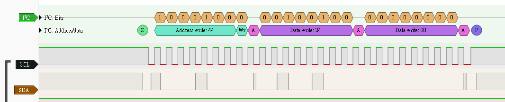
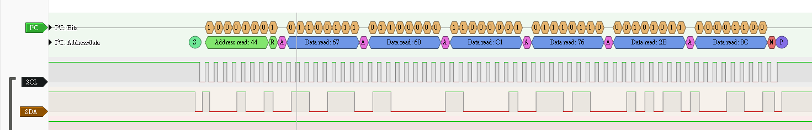

### 一、 Zadig 驅動程式下載與設定

因為使用不知名廠牌 USB Analyzer， Windows 無法識別 USB 裝置，必須透過 Zadig 強制綁定 WinUSB 驅動。

#### 1. 操作步驟

1. 下載並執行 Zadig（免安裝）。
2. 點選選單 `Options` $\rightarrow$ 勾選 `List All Devices`。
3. 在下拉選單尋找邏輯分析儀裝置（通常顯示為 `Unknown Device #1` 或 `fx2lafw`）。
4. 將右側目標驅動切換為 **WinUSB**。
5. 點擊 `Install Driver`。

### 二、 PulseView 下載與基礎設定

PulseView 是基於 sigrok 專案的開源前端介面，負責波形繪製與協定解碼。

#### 1. 裝置連線

1. 至 sigrok 官網下載 PulseView Windows 安裝檔並安裝。
2. 開啟 PulseView，點選上方裝置選單 $\rightarrow$ `Connect to Device`。
3. Driver 選擇 **fx2lafw (Generic driver for FX2 based devices)**。
4. Interface 選擇 **USB** $\rightarrow$ `Scan for devices` $\rightarrow$ 選取裝置並連線。

#### 2. 取樣參數設定

| 參數 | 建議設定 (針對 I2C) | 說明 |
| --- | --- | --- |
| **Sample Rate** | 1MHz | I2C 標準為 100kHz，取樣率只需大於訊號頻率 5~10 倍即可精準捕捉邊緣|
| **Sample Limit** | 2M samples | 決定可錄製的總時間長度，在此設定下是兩秒 |

#### 3. 實體硬體接線 (並聯監聽)

| 邏輯分析儀 | MCU (Master) | Sensor (Slave)|
| --- | --- | --- | 
| **GND** | GND | GND |
| **CH0** | SCL | SCL | 
| **CH1** | SDA | SDA |

* 透過麵包板作為中繼點將三者並聯，若直接拔除 Sensor 只接分析儀，將導致尋址失敗 (NACK)。

#### 4. 協定解碼
1. 點擊 `Add protocol decoder` 加入 I2C 解碼器。
2. 綁定對應的 SCL (CH0) 與 SDA (CH1) 通道。

#### 5. 觸發條件設定 (Trigger)
1. I2C 起始條件 (Start Condition)：SCL 保持高電位時，SDA 發生由高至低的跳變。
2. **設定方式**：點擊 SDA 對應通道 (CH1) 標籤，設定為 **下降沿觸發 (Falling Edge)**。
3. 點選 `Run` 進入等待狀態，隨後使用 Vscode 操作 MCU 開始傳輸即可獲得傳輸資料，下方 `i2c_measure_data`、`i2c_get_data` 作為範例

#### i2c_measure_data

#### i2c_get_data

